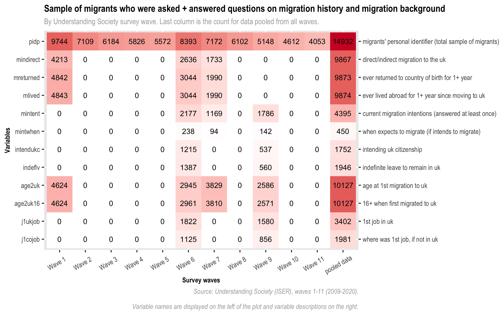

```{r, include = FALSE}
knitr::opts_chunk$set(echo = FALSE,
                      warning = FALSE,
                      message = FALSE)
```

```{r setup, include=FALSE}
library(knitr)
```

\newpage

# General introduction

The Migration \& Life dataset is designed to work as an extension of the dataset on time-invariant characteristics (xwavedat). It includes all born-abroad respondents who took part in the survey, regardless of which wave they entered and/or left it. The dataset pools data on migration from all waves of the survey, focusing on important aspects and dated milestones of migrants’ lives and migration-related experiences. 

# General use

Because the Migration \& Life dataset pools data from all waves, it is not typically meant to be used as a standalone dataset, but rather to be merged either with single-wave data, for cross-sectional analysis, or with data from multiple waves, for longitudinal analysis. The Migration \& Life dataset includes date information (on year of arrival to the UK, year of acquisition of British citizenship, etc). It could be used as a standalone dataset for the purpose of event history (survival) analysis if using relative time (e.g. time origin = year of arrival to the UK or year or birth, rather than a particular survey wave.)

# Weighting

## Cross-sectional and longitudinal weights
Understanding Society is a clustered, stratified survey which includes two targeted sample boosts of particular relevance to researchers interested in migration and ethnicity: the Ethnic Minority Boost sample (EMB), introduced at wave 1; and the Immigrant and Ethnic Minority Boost sample (IEMB) introduced at wave 2. More details on the design of these boost samples is available in the Understanding Society \href{https://www.understandingsociety.ac.uk/sites/default/files/downloads/documentation/mainstage/user-guides/user-guide-ethnicity-immigration-research.pdf}{User guide to ethnicity and immigration research}. These survey design features imply that the Understanding Society data is best used with survey weights, and that weights need to be used in order to produce representative analyses. Depending on how one chooses to use the Migration \& Life dataset (whether cross-sectionally or longitudinally), one will have to use either the cross-sectional weights or the longitudinal weights. 

## Weighting for non-response and attrition for pooled variables
In addition, because some of the time-invariant characteristics have been produced by pooling together data from questions which respondents may have answered at different waves, a rigorous weighting strategy would need to account for attrition and non-response bias. For instance, Understanding Society questionnaires include questions on whether born-abroad respondents migrated directly or indirectly from their country of birth to the UK. Due to the wave-specific questionnaires and sample design, some respondents were asked this question at wave 1, and some only at wave 6, and some at wave 7. Not all migrants were present in the survey at wave 1 (many entered it at wave 6 with the IEMB) and not all migrants present at wave 1 were still part of the survey at wave 7. The table underneath depicts some of these variations and the wave-specific and audience-specific distribution of variables related to migration experiences. 

The wave selection is also not random, as there were different criteria to be asked those questions at different waves: at wave 1, only non-white individuals were asked the ‘extra five minutes’ questions related to migration and ethnicity. At wave 6, only respondents from the IEMB were asked these questions. And the remaining migrants who had not been asked either at wave 1 or at wave 6 were then asked at wave 7. This means that the information for white migrants, for instance, would have been much more affected by attrition and non-response bias, especially if they were not part of the IEMB. They would not have been asked these questions the year they entered the survey, but at a later wave, if and only if they had not left the survey in-between. Thus, while the answer to the question on e.g. direct migration would presumably be the same regardless of when (at which wave) participants were asked, the odds that they would have been asked and therefore able to provide that information would differ.

  
# Variables: time-invariant 

```{r, fig.align='center', out.width="100%", include = TRUE, eval=FALSE}

```

## Timing of migration
This corresponds to the year of first migration to the UK: the variable name is \textit{yr2uk4} and is included in the xwavedat dataset.

## Age at migration
This is also an xwavedat variable: \textit{age2uk}. It includes a further variable on whether respondents migrated before the age of 16: \textit{age2uk16}.

## Country of birth
See infographic 

## Parents' and grandparents' country of birth
Pooled across waves.

## Direct/indirect migration
Participants in the ‘extra 5 minutes’ were asked at wave 1, 6 or 7 whether they had migrated directly from their country of birth to the UK, or if they had first migrated elsewhere, before later moving to the UK. The data from the different waves has been pooled into the mindirect variable. 

## Return migration and other migration
By the same selection process, some migrants were asked at wave 1, and others at wave 6 or 7, whether they had ever returned to their country of birth for a year or longer, and whether they had lived abroad (in another country that was not their country of birth) for a year or longer, since first moving to the UK. Since respondents were only asked these questions once (check), these have also been pooled and recoded into two time-invariant variables: mreturned and mlived.

## Other countries lived in before the UK

## Reasons for migration

## Whether mother and father worked in the country of birth (child migrants)


## Country of first job and first job in the UK


# Variables: Time-variant 
## Migration intentions
Mintent: whether intends to migrate
Mintwhen: when might migrate if intending to

## Citizenship intentions

## Citizenship and British naturalisation
The questionnaires include three sets of variables related to citizenship.
-	Question on whether respondents intend to apply for citizenship (if they are not British citizens), which was asked only at wave 6 and 9.
-	Retrospective question on the timing of acquisition of British citizenship (if they were born abroad, had migrated age 16 or older, and were British citizen at the time of interview), which was asked only at wave 6 and 9. 
-	Questions on current citizenship (whether British, citizenship of country of birth, or other, up to 3 cumulative citizenships), which were asked at wave 1 of the survey, then only of new entrants for wave 2, 3 and 4. From wave 5 onward it was also asked again of continuing born-abroad respondents who had not reported having UK citizenship before.
 
By tracking change in current citizenship, it was possible to impute a year of citizenship acquisition for 547 migrant respondents. But what kind of non-response weights ought to be recommended to attach to such a mixed variable (pooling retrospective question and multiple wave data)?

## Immigration status: indefinite leave to remain
Waves 6 and 9

## National identity

## English language skills
(other heatmap table needed)

\newpage
# Linked resources
All R code for the project is available on Github: \href{https://github.com/MarionLieutaud/Understanding-Society}{https://github.com/MarionLieutaud/Understanding-Society}.
The infographic will be available on the Understanding Society website.
The dataset will be accessible through the UK Data Service. 

## Infographic on migrant participants in Understanding Society
See webpage, joint work with UKLHS web design team
Provides wave-specific migrant samples and visualisation of wave-specific migration-related questionnaire content.

## R code: merge with single-wave
Code to merge the Migration \& Life dataset with a single wave individual and/or household data (for cross-sectional analysis).

## R code: merge with multiple waves
R code to merge the Migration \& Life dataset with multiple waves individual or household data (for longitudinal analysis)

## R code: reshape for event history
R code to reshape data on life-course milestones (e.g. timing of migration and timing of citizenship) into event history long format for the purpose of event history (survival) analysis.

## R code: reshape for state sequences
R code to reshape data on life-course milestones into successive states format for the purpose of sequence analysis.

## R code: construction of Migration \& Life
R code behind the construction of the Migration \& Life dataset.

\newpage
# Data citation
The bibliographic reference for this study is as follows:

**Citing this study**

The format for bibliographic references for the Migration and Life study is as follows:
Lieutaud, Marion, University of Essex, Institute for Social and Economic Research. (2023). Understanding Society:
Migration & Life, 2009-2021. [data collection]. 1st Edition. UK Data Service. SN:TBD.

**Citing this User Guide**

Lieutaud, Marion (2023). Understanding Society: Migration & Life, 2009-2021 User Guide. Colchester: University of Essex.

**Citing the Understanding Society survey**

The format for bibliographic references for the Understanding Society survey overall is as follows:
University of Essex, Institute for Social and Economic Research, NatCen Social Research,
Kantar Public. (2020). Understanding Society: Waves 1-12, 2009-2021 and Harmonised
BHPS: Waves 1-18, 1991-2009. [data collection]. 17th Edition. UK Data Service. SN: 6614, \href{http://doi.org/10.5255/UKDA-SN-6614-18}{http://doi.org/10.5255/UKDA-SN-6614-18}.

# Acknowledgements
Understanding Society is an initiative funded by the Economic and Social Research Council
and various Government Departments, with scientific leadership by the Institute for Social
and Economic Research, University of Essex, and survey delivery by NatCen Social Research
and Kantar Public. The research data are distributed by the UK Data Service.
I would like to warmly thank the whole Understanding Society team for offering me the Understanding Society Fellowship which made this study possible, and especially Alita Nandi, Olena Kaminska, Becky Parsons, John Payne, Jack Kneeshaw and Jolanda James for their help and support throughout. I am grateful also to the Understanding Fellows 2022 cohort for their friendliness and expert suggestions. 

